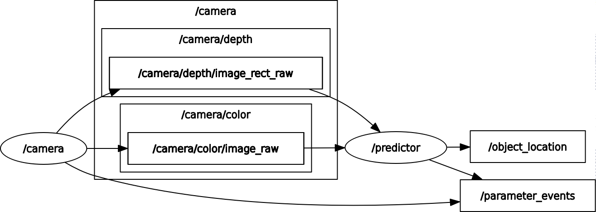
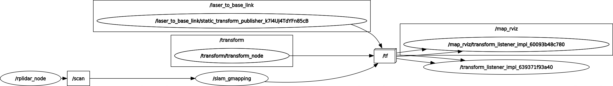
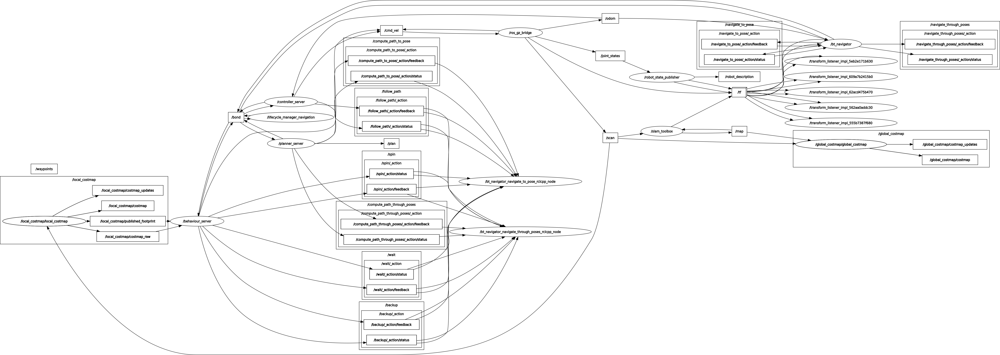
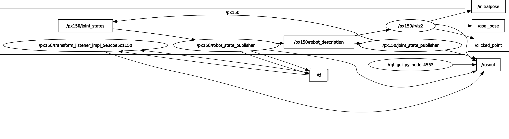

# Robotic Systems Design Project Team2 (UoM AERO62520)

## Introduction

Welcome to Team2's Git repository!
We're MSc Robotics postgraduate students at the University of Manchester. This is the code repository for our Robotic Systems Design Project (AERO62520), and the progress of our work is updated here in real time. The goal of this project is to use existing materials to implement a robot that explores autonomously and can recognise a target object and bring it back.

| Kit                              | Description                                                  |
| -------------------------------- | ------------------------------------------------------------ |
| LEO Core                         | Serving as the robot's brain, the LEO Core processes sensor data and controls movements, ensuring smooth and coordinated operation of all tasks. |
| Intel NUC                        | Used for handling intensive computation, the Intel NUC runs complex algorithms for object recognition and decision-making, significantly boosting the robot's autonomous capabilities. |
| Battery                          | A rechargeable battery pack powers the entire system, enabling the robot to operate independently without relying on an external power source. |
| Powerbox                         | Responsible for distributing power from the battery to all components, the Powerbox ensures stable voltage and prevents overloads, supporting safe and reliable operation. |
| RPLIDAR A2M12                    | This 2D laser scanner measures distances to map the environment and detect obstacles, playing a key role in navigation and collision avoidance. |
| Intel RealSense Depth Camera     | By providing 3D depth information, this camera helps the robot understand its surroundings, enhancing obstacle detection and navigation precision. |
| Trossen PincherX 150 Manipulator | Equipped with a robotic arm, the robot can physically interact with objects, including grasping and moving them, enabling object manipulation tasks. |
| Raspberry Pi 4 Model B           | Handling less intensive tasks like image processing and communication, the Raspberry Pi supports object recognition and task planning while ensuring smooth sensor operation. |
| Camera                           | Capturing visual data, the camera plays a critical role in recognizing objects, analyzing the environment, and aiding navigation. |
| 2.4GHz WiFi Adapter              | Enabling wireless communication, the Wi-Fi adapter allows real-time control, monitoring, and data transfer between the robot and external systems. |

## Members

- Yuliang Li https://github.com/Lyrance
- Zihan Yue https://github.com/AvidLuv
- Jiadong Hou https://github.com/hou-jd
- Zixiang He https://github.com/Hzxxxxxxx

## Getting Started

> Ubuntu 22.04 LTS; ROS2 Humble; Python 3.10.12

### Step1: Clone

```bash
git clone https://github.com/Lyrance/Robotics_Team2.git
```

### Step2: Build

Make sure you have setup the environment. Then.

```bash
cd Robotics_Team2
colcon build
source install/setup.bash
```

### Step3: Run

We usually use `ros2 run` to run ros2 nodes and `ros2 launch` to interact with launch files. Specific names and descriptions of each node are shown below.

For example, we could use this command to run the predictor node.

```bash
ros2 run object_detection predict
```

## Documentation

### Requirements

| NAME                             | source                                                       |
| -------------------------------- | ------------------------------------------------------------ |
| rplidar_ros                      | https://github.com/Slamtec/rplidar_ros                       |
| Intel® RealSense™ SDK 2.0        | sudo apt install ros-humble-librealsense2*                   |
| ROS servers of Intel® RealSense™ | sudo apt install ros-humble-realsense2-*                     |
| ultralytics                      | https://docs.ultralytics.com/quickstart/#install-ultralytics |
| SLAM-Toolbox                     | https://github.com/SteveMacenski/slam_toolbox                |
| nav2                             | https://docs.nav2.org                                        |
| interbotix_ros_manipulators      | https://github.com/Interbotix/interbotix_ros_manipulators    |
| *To Be Continued...*             |                                                              |

### Nodes

> Some nodes are under testing. We will release them later.

- predictor: The `camera` node streams depth and color information at a fixed frequency by publishing depth data to the `/camera/depth/image_rect_raw` topic and color images to the `/camera/color/image_raw` topic. Our custom `predictor` node subscribes to these topics, leveraging the color image data to infer the target object's \(x, y\) coordinates and utilizing the depth information to calculate the distance to the object's center. Finally, the computed coordinates of the target object are published to the `/object_location` topic for further use. 

  

- mapping: The RPLIDAR A2M12 uses Time of Flight (ToF) technology to calculate distances by measuring the time taken for emitted laser beams to reflect back. In ROS, the `rplidar_a2m12_launch.py` launches the `rplidar_node`, which publishes scan data to the `/scan` topic as `sensor_msgs/LaserScan`. Its effective range is 0.15–7m, suitable for the application.The Mapping feature is implemented via the GMapping algorithm, combining LiDAR data (`/scan`) and odometer data. LiDAR detects obstacles, while odometry provides motion estimates. The system uses particle filtering and scan matching to generate a global map in real time, achieving simultaneous localization and mapping (SLAM). The resulting map and position data are published as ROS messages for other modules.

  

- navigation: The NAV2 package is a robust system for robot navigation, integrating the SLAM_Toolbox for occupancy grid mapping and localization to enable autonomous movement. It utilizes input data such as pose transformations (`/tf`), lidar scans (`/scan`), occupancy maps (`/map`), odometry (`/odom`), and goal positions (`/goal_pose`) from the frontier algorithm. 

  Navigation is managed by two key components: the planner and the controller, orchestrated under a behavior tree. The planner, using the NavFn plugin with the A* algorithm, calculates a safe, obstacle-aware path to the target. The controller, powered by the DWB plugin, generates motion commands to keep the robot on track, adjusting based on real-time pose, velocity, and sensor feedback. The behavior tree ensures seamless coordination, enabling advanced functions like obstacle avoidance and recovery from errors.

  By integrating these components, the NAV2 stack delivers reliable navigation, publishing essential data such as motion commands (`/cmd_vel`), paths (`/path`, `/plan`, `/local_plan`), costmaps (`/costmap`, `/global_costmap`), and planner/controller status updates. This system supports autonomous operation in both known and unknown environments.

  

- grasp: The integration of the Trossen PincherX 150 manipulator into the robotic system was achieved using the `interbotix_ros_manipulators` package. This package offers robust tools and interfaces for precise control of the manipulator. A key component of this setup involves the `/px150/joint_states` topic, which publishes `/sensor_msgs/JointState` messages containing critical information such as joint names, positions, velocities, and efforts. The system's custom `Arm_Control` node processes these joint states by interpreting data from the `object_pose_to_camera` topic, which provides `/sensor_msgs/geometry_msgs` messages. Using this data, the node calculates the necessary joint configurations to position the end effector accurately, enabling it to grasp objects and deposit them into the retrieval mechanism. 

  